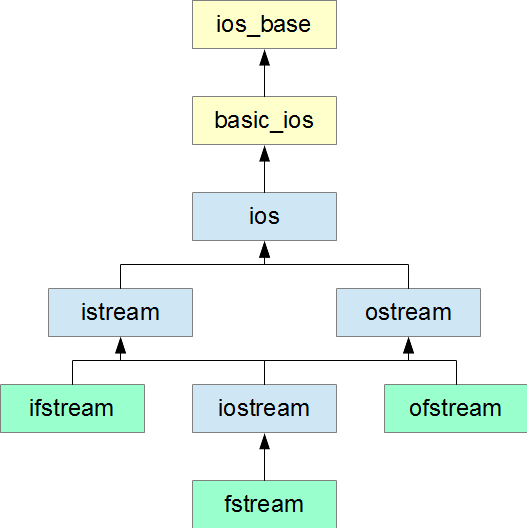

# Множествено наследяване
Множественото наследяване позволява на един клас да наследява няколко базови класове:
```cpp
class A 
{
public:
    void show() { std::cout << "A\n"; }
};

class B 
{
public:
    void display() { std::cout << "B\n"; }
};

class C : public A, public B 
{
    // Наследява членовете и от A, и от B
};
```

## Диамантен проблем
Той възниква, когато два класа наследяват един и същ базов клас, а след това трети клас ги наследява и двата.

```cpp
class A 
{
public:
    int value;
};

class B : public A {};
class C : public A {};

class D : public B, public C {};
```

При тази ситуация, класът D ще съдържа две копия на A::value - едното, което идва от B, а другото - от C. 

```cpp
// main.cpp

D obj;
// obj.value = 5; // Грешка: нееднозначност, кой value?
obj.B::value = 5;
obj.C::value = 10;
```
Димантения проблем се среща и в стандартната библиотека на езика и по-точно в `std::iostream` и `std::fstream`.



### Виртуално наследяване

Tози проблем се решава с т.нар. виртуално наследяване. То гарантира, че само едно копие от членовете на базовия клас ще бъде налично, независимо колко пъти той е наследен по пътя.
```cpp
class A 
{
public:
    int value;
};

class B : virtual public A {};
class C : virtual public A {};

class D : public B, public C {};
```

Забележете, че наследяваме виртуално само и едниствено най-базовия клас (този, чиито данни биха се копирали 2 пъти).

**Важно:** Когато наследяваме виртуално, конструкторът на най-базовия клас се вика само 1 път, от най-дълбокото ниво на наследяване. Т.е.:
- Ако създаваме обект от тип B, трябва да викнем конструктор на A
- Ако създаваме обект от тип C, трябва да викнем конструктор на A
- **Ако създаваме обект от тип B, трябва да викнем конструктори на A, B и C**
    - Конструкторът на А ще се изпълни първи, като следващите викания на конструктор на А (от B и C) ще бъдат *игнорирани*.

# clone

В контекста на полиморфизма често се налага да **създадем копие** на обект, когато разполагаме **само с указател или референция към базов клас**.

Проблем:

```cpp
Animal** animals = new Animal*[2];
animals[0] = new Dog();
animals[1] = new Cat();

Animal** copy = new Animal*[2];

for (int i = 0; i < 2; i++)
{
    copy[i] = new Animal(*animals[i]); // bad: object slicing +  възможно е Animal да е абстрактен клас

    copy[i] = animals[i]; // bad: shallow copy
}
```

Решение: дефинираме виртуален метод clone(), който всеки клас override-ва, като връща копие на себе си.

```cpp
class Animal
{
public:
    //...

    virtual void Speak() const = 0;
    virtual Animal* clone() const = 0;
};

class Dog : public Animal
{
public:
    void Speak() const override
    {
        std::cout << "Woof!\n";
    }

    Dog* clone() const override
    {
        return new Dog(*this);
    }
};


class Cat : public Animal
{
public:
    void Speak() const override
    {
        std::cout << "Meow!\n";
    }

    Cat* clone() const override
    {
        return new Cat(*this);
    }
};
```

```cpp
Animal** animals = new Animal*[2];
animals[0] = new Dog();
animals[1] = new Cat();

Animal** copy = new Animal*[2];

for (int i = 0; i < 2; i++)
{
    copy[i] = animals[i]->clone(); // ok
}
```
